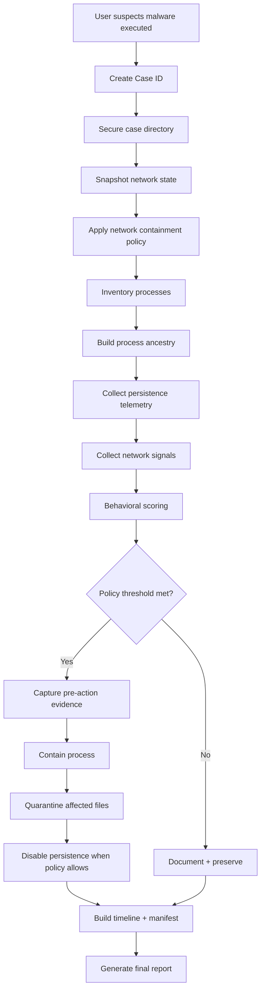
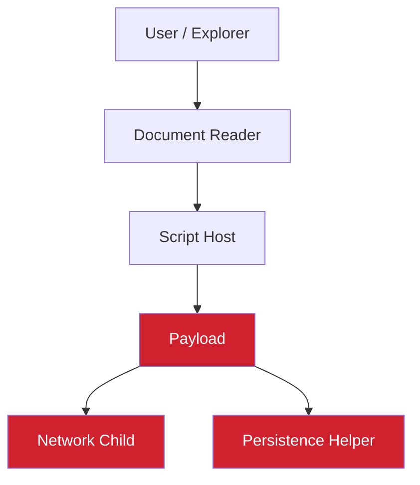
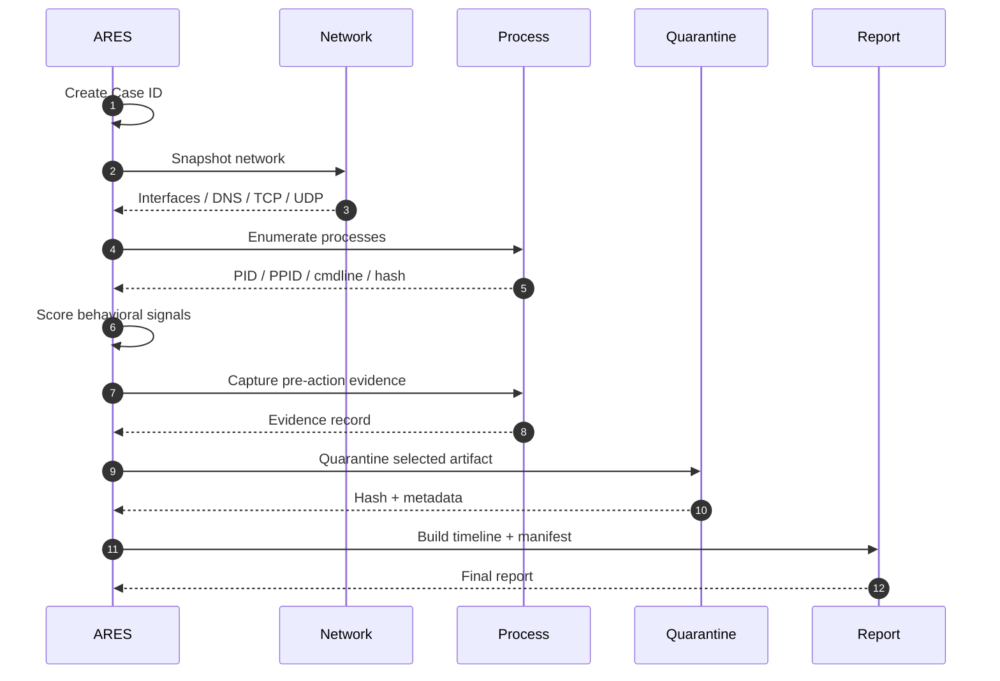
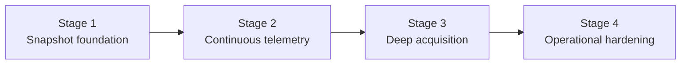

# ARES — shutdown

<p align="center">
  
</p>

<p align="center">
  <strong>Emergency incident containment for Windows.</strong><br>
  <em>Isolate first. Preserve evidence. Contain deliberately. Recover manually.</em>
</p>

<p align="center">
  
  
  
  
  
</p>

> **ARES — shutdown is not an antivirus.** It is an emergency response and containment system designed for the critical window immediately after suspicious or malicious code has executed on a Windows endpoint.

---

## Table of Contents

- [What is ARES?](#what-is-ares)
- [The Problem](#the-problem)
- [Design Philosophy](#design-philosophy)
- [Core Priorities](#core-priorities)
- [How ARES Responds](#how-ares-responds)
- [Architecture](#architecture)
- [Incident Lifecycle](#incident-lifecycle)
- [Behavioral Scoring](#behavioral-scoring)
- [Emergency Profiles](#emergency-profiles)
- [Network Containment](#network-containment)
- [Process Containment](#process-containment)
- [Persistence Handling](#persistence-handling)
- [Quarantine & Chain of Custody](#quarantine--chain-of-custody)
- [Evidence Model](#evidence-model)
- [Integrity & Tamper Evidence](#integrity--tamper-evidence)
- [Truthful State Reporting](#truthful-state-reporting)
- [Recovery](#recovery)
- [Case Layout](#case-layout)
- [Operational Workflow](#operational-workflow)
- [Usage](#usage)
- [Security Boundaries](#security-boundaries)
- [Threat Model](#threat-model)
- [Current Limitations](#current-limitations)
- [Stage 2 / Stage 3 Roadmap](#stage-2--stage-3-roadmap)
- [Design Decisions](#design-decisions)
- [Project Structure](#project-structure)
- [Contributing](#contributing)
- [Responsible Use](#responsible-use)
- [Project Status](#project-status)

---

## What is ARES?

**ARES** is an incident-response utility for the moment when a user suspects that a malicious executable, script, loader, RAT, stealer, dropper, or other untrusted payload has already been executed.

Its job is deliberately narrower than a traditional endpoint security product:

```text
The malware already ran.
        │
        ▼
ARES assumes the first minutes matter.
        │
        ├── Isolate the endpoint
        ├── Preserve evidence before destructive actions
        ├── Inventory processes, ancestry and network state
        ├── Evaluate behavior using multiple independent signals
        ├── Contain only what policy allows
        ├── Quarantine files instead of deleting them
        ├── Document persistence instead of silently destroying history
        └── Produce a case package that can be reviewed later
```

ARES is therefore best described as a **controlled emergency brake** for Windows endpoints.

It does **not** promise prevention, complete malware detection, perfect attribution, or guaranteed recovery.

---

## The Problem

A suspicious file does not need to remain visible on screen to be dangerous.

After execution, a threat may attempt to:

- establish persistence through **Run keys, Startup folders, Scheduled Tasks, Services, or WMI**;
- steal browser material, session cookies, tokens, or credentials;
- communicate with a remote **command-and-control (C2)** infrastructure;
- spawn child processes and abuse legitimate Windows tooling;
- survive the original process through another process, task, service, or script;
- move laterally to other systems reachable from the endpoint.

The difficult part is the timing.

The first response can easily destroy useful evidence if it is performed carelessly. Killing a process, deleting a file, disabling a task, or changing firewall state without recording what existed first can turn an incident into an incomplete investigation.

ARES is built around the opposite principle:

> **Record enough state to explain what you saw, then take the smallest policy-allowed action required to reduce harm.**

---

## Design Philosophy

### 1. Tamper-evident, not tamper-proof

ARES chains JSONL events using SHA-256. Each event references the hash of the previous event, making later modification or truncation detectable.

This is intentionally **not** presented as cryptographic protection against a privileged attacker. An actor with sufficient local privilege can potentially rewrite the entire evidence set.

The operational rule is therefore simple:

> **Export or copy the evidence package off-host as soon as practical.**

### 2. Record before action

Potentially destructive operations follow a strict pattern:

```text
Observe → Hash → Snapshot → Log → Act
```

For example, before terminating a suspicious process, the evidence layer attempts to capture its process metadata, ancestry, executable identity, command line, signature state, and network context.

### 3. Every action gets a transaction

System modifications are tracked in a separate transaction ledger.

A transaction should answer:

- What changed?
- Why did policy allow it?
- What object was affected?
- What evidence existed beforehand?
- Was the action fully successful?
- What can be restored manually?

### 4. No fake certainty

ARES distinguishes between:

- `SUCCESS`
- `PARTIAL`
- `FAILED`
- `NOT_AVAILABLE`

And its final reporting model distinguishes evidence interpretation as:

- **Observed** — directly recorded;
- **Inferred** — derived from observed facts;
- **Suspected** — plausible but not established;
- **Unknown** — not available or not verifiable.

### 5. No single weak signal should trigger a major response

An unsigned executable is not automatically malware.

A Temp-path executable is not automatically malware.

A suspicious filename is not automatically malware.

ARES instead combines evidence across independent categories such as execution path, ancestry, persistence, network behavior, and signing state.

### 6. Protect critical Windows processes

Core operating-system processes are explicitly protected from termination. The protection remains active even in the most aggressive emergency profile.

Examples include:

```text
lsass.exe
services.exe
wininit.exe
explorer.exe
```

The exact deny-list is an implementation control, not a recommendation to terminate or modify Windows security processes manually.

---

## Core Priorities

ARES uses a strict priority order:

```text
┌──────────────────────────────┐
│  1. CONTAINMENT              │  ← reduce active harm
├──────────────────────────────┤
│  2. EVIDENCE PRESERVATION    │  ← keep context intact
├──────────────────────────────┤
│  3. ATTRIBUTION              │  ← understand what happened
├──────────────────────────────┤
│  4. RECOVERY                 │  ← reverse controlled actions
├──────────────────────────────┤
│  5. CONVENIENCE              │  ← never above incident safety
└──────────────────────────────┘
```

The priority matters because emergency response is full of trade-offs.

**ARES prefers an explicit limitation over an invisible side effect.**

---

## How ARES Responds

<p align="center">
  
</p>

At a high level:



---

## Architecture

```text
                         ┌──────────────────────────┐
                         │      Start-ARES.ps1      │
                         │       Case Orchestrator  │
                         └────────────┬─────────────┘
                                      │
               ┌──────────────────────┼──────────────────────┐
               │                      │                      │
               ▼                      ▼                      ▼
      ┌─────────────────┐    ┌─────────────────┐    ┌─────────────────┐
      │ ARES.Policy     │    │ ARES.Logging    │    │ ARES.Evidence   │
      │ profile / rules │    │ JSONL / ledger  │    │ timeline/report  │
      └────────┬────────┘    └────────┬────────┘    └────────┬────────┘
               │                      │                      │
       ┌───────┼────────┐             │             ┌────────┼─────────┐
       ▼       ▼        ▼             ▼             ▼        ▼         ▼
   Network  Process  Persistence  Case context  Quarantine  Manifest  Report
      │       │        │
      └───────┴────────┴───────────────────────────────────────────────┐
                                                                        │
                                                                        ▼
                                                     ┌──────────────────────────┐
                                                     │     Windows Endpoint     │
                                                     │ processes / tasks / FW   │
                                                     └──────────────────────────┘
```

### Module boundaries

| Module | Responsibility |
|---|---|
| `ARES.Logging.psm1` | Case identity, JSONL event chain, transaction ledger, Windows Event Log, ACL handling |
| `ARES.Network.psm1` | Interface and connection snapshots, firewall containment |
| `ARES.Process.psm1` | Process inventory, ancestry reconstruction, leaf-to-root containment |
| `ARES.Scoring.psm1` | Weighted behavioral scoring, severity and reasons |
| `ARES.Persistence.psm1` | Run keys, Startup, Scheduled Tasks, Services, WMI persistence discovery |
| `ARES.Quarantine.psm1` | Reversible file quarantine, metadata, custody records |
| `ARES.Evidence.psm1` | Timeline, evidence package, manifest hashes, final report |
| `ARES.Policy.psm1` | Central policy engine and emergency profiles |

The modules receive a shared **case context object** rather than relying on uncontrolled global state.

---

## Incident Lifecycle

The orchestrator follows eight major stages.

| Stage | Objective | Primary output |
|---:|---|---|
| `0` | Safe initialization | Case ID, secure directories, environment record |
| `1` | Immediate network containment | Interface + IP + DNS + TCP/UDP snapshot and policy actions |
| `2` | Process inventory | Process table, ancestry and signing state |
| `3` | Telemetry inputs | Persistence and network observations |
| `4` | Behavioral assessment | Score, severity, reasons |
| `5` | Process containment | Pre-action evidence + transaction records |
| `6` | File quarantine | SHA-256 named artifacts + metadata |
| `7` | Persistence handling | Reversible disabled entries when policy allows |
| `8` | Evidence + reporting | Timeline, manifest, archive, final report |

### Stage 0 — Safe initialization

ARES begins by establishing a unique **Case ID** and a dedicated case directory.

It attempts to:

- restrict the case directory to `SYSTEM` and administrators;
- record execution metadata;
- register a source event in Windows Event Log;
- hash the executing script or relevant launcher content;
- initialize the JSONL event chain.

The case becomes the unit of accountability for everything that follows.

### Stage 1 — Network containment

Before process-level action, ARES snapshots the endpoint's network state and applies the selected network policy.

Captured context may include:

```text
interfaces
IP configuration
DNS configuration
TCP state
UDP state
active connections
firewall actions
```

### Stage 2 — Process enumeration

ARES builds a process inventory containing, where available:

```text
PID
PPID
image path
command line
user / owner
SHA-256
signature state
signer identity
network associations
```

It also reconstructs process ancestry so a suspicious child process can be understood in context.

### Stage 3 — Telemetry inputs

The persistence layer examines supported autostart mechanisms, while network telemetry supplies connection context.

Important: some high-value telemetry is intentionally marked `NOT_AVAILABLE` in Stage 1 rather than fabricated.

### Stage 4 — Behavioral scoring

Each process receives a weighted score and an explainable list of reasons.

### Stage 5 — Process containment

When policy thresholds are met, ARES prefers **leaf-to-root** containment: the most dependent/suspicious child processes are considered before their ancestors.

This reduces the chance of immediately collapsing legitimate parent infrastructure while still addressing the suspicious execution chain.

### Stage 6 — Quarantine

Files are moved into the case's quarantine area and identified by SHA-256. A sidecar metadata record preserves information about the original location and action.

**Files are not silently deleted.**

### Stage 7 — Persistence handling

In profiles that permit it, supported persistence artifacts can be disabled using a reversible naming convention such as:

```text
ARES_DISABLED_<original-name>
```

The original is retained in the evidence model so a reviewer can reconstruct what changed.

### Stage 8 — Evidence package

The final stage constructs a unified timeline, manifest and final report.

---

## Behavioral Scoring

ARES is intentionally explainable.

A score is not meant to answer the question:

> “Is this file definitely malware?”

It is meant to answer:

> “How much independently observed behavior justifies containment under the current policy?”

### Example signal weights

| Category | Example signal | Weight |
|---|---|---:|
| Signing | Unsigned binary | `20` |
| Signing | Invalid signature | `15` |
| Path | Executed from Temp | `15` |
| Path | Executed from Downloads | `10` |
| Path | Executed from AppData | `10` |
| File age | Created within 24 hours | `10` |
| Name | Suspicious naming pattern | `10` |
| Ancestry | Office/Browser → Shell | `30` |
| Ancestry | PowerShell → unsigned payload | `25` |
| Ancestry | LOLBin → payload | `25` |
| Ancestry | Unexpected parent | `20` |
| Network | Suspicious external connection | `25` |
| Network | Beacon-like behavior | `20` |
| Intent | Persistence creation | `30` |
| Intent | Credential-access indication | `30` |
| Intent | Injection indication | `35` |

### Severity thresholds

```text
CRITICAL  >= 90
HIGH      >= 55
MEDIUM    >= 25
LOW       >  0
NONE      == 0
```

### Explainability

A result should look conceptually like this:

```text
Severity: HIGH
Score: 73

Reasons:
- Unsigned executable                     +20
- Executed from AppData                  +10
- Browser → PowerShell ancestry          +30
- Suspicious external connection         +25

Confidence notes:
- Observed: process ancestry
- Observed: unsigned image
- Observed: external connection
- Inferred: execution chain is unusual
- Unknown: credential access telemetry unavailable
```

The point is not to make a magical number. The point is to produce a **traceable justification** for the action selected by policy.

---

## Emergency Profiles

ARES supports four conceptual emergency profiles.

| Profile | Network | Containment threshold | Persistence | Quarantine | Memory |
|---|---|---|---|---|---|
| `STANDARD` | isolate-all | `HIGH` | document only | `MEDIUM` | not enabled |
| `AGGRESSIVE` | isolate-all | `MEDIUM` | disable when supported | `MEDIUM` | enabled for later stage |
| `FORENSIC` | suspicious-only | `CRITICAL` | document only | `HIGH` | enabled for later stage |
| `LOCKDOWN` | hard-disconnect | `MEDIUM` | disable when supported | `LOW` | enabled for later stage |

### Choosing a profile

The profile is a **policy decision**, not an automatic conclusion about the incident.

For example:

- `STANDARD` favors containment without aggressive persistence modification.
- `AGGRESSIVE` favors faster disruption of suspicious execution.
- `FORENSIC` favors preserving more system context and reducing broad changes.
- `LOCKDOWN` favors endpoint isolation when continued network exposure is unacceptable.

ARES should always expose which profile was active in the case record.

---

## Network Containment

ARES separates network containment into three conceptual policies.

### `suspicious-only`

Do not broadly disconnect the endpoint. Instead, block selected suspicious network activity where sufficient evidence exists.

### `isolate-all`

Apply a broad inbound/outbound containment policy with tightly controlled exceptions where the implementation requires them.

### `hard-disconnect`

Disable active network interfaces and preserve their original state for manual recovery.

### Rule ownership

ARES rules are tagged with a case identifier:

```text
ARES-<CaseId>
```

Recovery can then target ARES-owned rules rather than blindly altering the endpoint's entire firewall configuration.

> **Design requirement:** containment must be attributable. A firewall change without case ownership is a recovery problem waiting to happen.

---

## Process Containment

ARES builds a process tree instead of treating every PID as an isolated object.



The preferred containment direction is:

```text
leaf child → suspicious helper → payload → suspicious parent
```

not:

```text
random PID → terminate whatever looks scary → hope nothing breaks
```

### Protected processes

ARES maintains an explicit protected-process policy. Critical Windows processes are never eligible for routine termination through this emergency workflow.

### Before termination

The evidence layer attempts to capture:

- process metadata;
- command line;
- executable path;
- SHA-256;
- signer / signature state;
- parent and child relationships;
- network context;
- action reason;
- current case and policy.

---

## Persistence Handling

ARES looks for supported persistence mechanisms such as:

```text
HKCU / HKLM Run keys
Startup folders
Scheduled Tasks
Windows Services
WMI-based persistence
```

Persistence handling follows a crucial distinction:

**discovery is not the same thing as destruction.**

Depending on the active profile, ARES may:

1. document the persistence artifact;
2. mark it for review;
3. disable it using a reversible convention;
4. retain evidence of its original identity and location.

Deletion is intentionally avoided where a reversible action is possible.

---

## Quarantine & Chain of Custody

ARES uses reversible quarantine instead of deletion.

Conceptually:

```text
Original file
     │
     ├── SHA-256
     ├── original path
     ├── metadata
     ├── timestamp
     ├── action / policy
     ▼
Case quarantine
     │
     └── <sha256>.quarantined
         <sha256>.meta.json
```

### Why SHA-256 naming?

The hash gives the artifact a stable content identity and avoids relying on a mutable filename.

### Metadata should preserve

- original path;
- hash;
- size where available;
- timestamps where available;
- quarantine timestamp;
- case ID;
- triggering reasons;
- transaction ID;
- restoration state.

### No automatic deletion

Deleting suspected malware can remove useful forensic material and makes post-incident review harder. ARES therefore treats deletion as outside its default emergency workflow.

---

## Evidence Model

A case is designed to remain understandable without the live system.

Expected evidence files include:

```text
process_tree.json
persistence.json
network.json
timeline.json
timeline.txt
incident.json
configuration.json
manifest.json
final_report.txt
```

### Unified timeline

The timeline joins events from different subsystems into one chronological view.



### Manifest hashing

The evidence package should include a manifest containing hashes for its constituent files.

This gives the reviewer a way to verify that the package they received matches the package generated at collection time.

---

## Integrity & Tamper Evidence

ARES uses a hash chain for the JSONL event stream.

Conceptually:

```text
Event N-1
  │
  └─ SHA-256 ──► PreviousHash
                     │
Event N              │
  ├─ Timestamp       │
  ├─ CaseId          │
  ├─ Action           │
  ├─ Outcome          │
  └─ CurrentHash ◄───┘
```

A simplified model:

```text
CurrentHash = SHA256(
    PreviousHash
    + CanonicalEventData
)
```

### What this gives you

It can reveal:

- modified events;
- reordered events;
- removed events from the middle of a sequence;
- some forms of truncation.

### What this does not give you

It does **not** provide an immutable external evidence store.

A sufficiently privileged attacker who controls the host may be able to rewrite both the records and the chain.

That is why off-host evidence transfer remains part of the recommended operational workflow.

---

## Truthful State Reporting

ARES intentionally refuses to turn missing telemetry into a fake positive.

### Action outcome states

| State | Meaning |
|---|---|
| `SUCCESS` | Requested action completed and was verified |
| `PARTIAL` | Some requested work completed, but not all |
| `FAILED` | Requested action could not be completed |
| `NOT_AVAILABLE` | Required capability or telemetry is not present |

### Evidence confidence labels

| Label | Meaning |
|---|---|
| `Observed` | Directly collected fact |
| `Inferred` | Derived from one or more observed facts |
| `Suspected` | Reasonable hypothesis, not established |
| `Unknown` | Insufficient evidence to conclude |

This distinction is one of the most important parts of the project.

A professional incident tool must be able to say:

> **“We do not know.”**

without turning that into:

> **“Therefore it did not happen.”**

---

## Recovery

Recovery is intentionally **manual and controlled**.

The recovery tool is:

```text
Invoke-AresRecovery.ps1
```

Conceptual recovery operations include:

```text
-RemoveNetworkContainment
-RestoreQuarantinedFile
```

### Network recovery

ARES removes its own case-tagged firewall rules and can re-enable interfaces disabled by the current case.

### File recovery

A specific quarantined file can be restored only as an explicit action. Existing destination files should not be overwritten unless the operator deliberately forces it.

### Persistence recovery

Persistence is **never silently re-enabled** by automatic recovery.

The operator reviews `persistence.json` and decides what should be restored.

This is deliberate:

```text
Recovery ≠ rollback everything blindly
```

Recovery is a human-reviewed change process.

---

## Case Layout

By default, a case is stored below:

```text
C:\ProgramData\ARES-Shutdown\Cases\<CaseId>\
│
├── logs\
│   ├── ares.jsonl
│   └── transactions.jsonl
│
├── evidence\
│   ├── process_tree.json
│   ├── persistence.json
│   ├── network.json
│   ├── timeline.json
│   ├── timeline.txt
│   ├── incident.json
│   ├── configuration.json
│   ├── manifest.json
│   └── final_report.txt
│
├── quarantine\
│   ├── <sha256>.quarantined
│   └── <sha256>.meta.json
│
└── memory\
    └── reserved for later acquisition stages
```

### Case portability goal

The public case shape should remain stable as new collection capabilities are added.

Stage 2/3 telemetry should extend the package rather than forcing investigators to relearn a new case format every time the tool grows.

---

## Operational Workflow

A practical emergency workflow is:

```mermaid
flowchart LR
    A[Suspected execution] --> B[Launch ARES elevated]
    B --> C[Select emergency profile]
    C --> D[Network snapshot + containment]
    D --> E[Process / persistence inventory]
    E --> F[Behavioral assessment]
    F --> G[Contain allowed targets]
    G --> H[Quarantine where appropriate]
    H --> I[Review final report]
    I --> J[Copy evidence off-host]
    J --> K[Human-led recovery]
```



### Recommended operator sequence

1. **Run the response tool with the required administrative privileges.**
2. **Select the emergency profile appropriate to the incident objective.**
3. **Allow the initial snapshot to complete before making additional manual changes.**
4. **Review the case output and action ledger.**
5. **Copy the evidence package to trusted external storage as soon as practical.**
6. **Use the recovery utility only after reviewing the recorded changes.**

The most important operational rule is to avoid turning an emergency response into a second, undocumented incident.

---

## Usage

The repository provides two primary entry points:

```text
Start-ARES.ps1
Invoke-AresRecovery.ps1
```

A minimal invocation shape is:

```powershell
# Run from an elevated PowerShell session.
.\Start-ARES.ps1
```

Recovery is similarly explicit:

```powershell
# Review the case first, then perform only the required recovery action.
.\Invoke-AresRecovery.ps1
```

> **Implementation note:** command-line parameters should be treated as implementation-defined until the script help surface is finalized. The README intentionally avoids inventing flags that are not guaranteed to exist in the current Stage 1 build.

For a deployment, verify the current script help and test the chosen emergency profile in a controlled lab before relying on it during a live incident.

---

## Security Boundaries

ARES operates at the boundary between incident response and operating-system administration.

### It assumes

- administrative access may be required for some actions;
- Windows security controls can refuse an operation;
- another privileged process may already be active;
- malware may attempt to interfere with response tooling;
- telemetry may be incomplete;
- network state can change during collection.

### It does not assume

- every suspicious process is malicious;
- every missing signal means the signal was absent;
- every action succeeds because a command returned without an exception;
- local logs are immutable;
- a single snapshot can prove the entire incident timeline.

---

## Threat Model

ARES is primarily designed for **post-execution containment**, not for defeating a fully compromised kernel or a hostile hypervisor.

### In scope

```text
RATs
stealers
loaders
droppers
malicious scripts
unexpected child processes
persistence attempts
suspicious network activity
rapid-response endpoint isolation
```

### Partially in scope

```text
credential theft
memory-only activity
process injection
browser/session theft
kernel-level tampering
```

These areas require deeper telemetry than the Stage 1 snapshot architecture currently guarantees.

### Out of scope for Stage 1

- guaranteed memory acquisition;
- continuous ETW-based process monitoring;
- kernel-level collection;
- fully autonomous unattended remediation;
- cryptographically immutable evidence on a compromised host;
- complete attribution of an attacker or infrastructure.

---

## Current Limitations

ARES is intentionally honest about what is **not** implemented yet.

### Stage 1 is snapshot-based

The current architecture collects a point-in-time view. It is not yet a persistent sensor that monitors every subsequent process creation or kernel event.

### Credential-access telemetry is incomplete

Reliable visibility into LSASS and browser credential stores requires additional telemetry collection, such as a dedicated ETW/Sysmon-backed component, which belongs to a later stage.

For Stage 1, unavailable telemetry is represented as:

```text
NOT_AVAILABLE
```

not as a fabricated “clean” or “blocked” result.

### Continuous process monitoring is not guaranteed

A threat that starts after the initial process inventory may fall outside the first observation window.

### Memory acquisition is not yet deterministic

The `memory/` directory exists as a forward-compatible location for bounded memory collection in later stages.

### Kernel component is future work

An optional signed kernel component is part of the long-term architecture, not a claim of current capability.

### Unattended watchdog behavior is future work

A Windows service/watchdog can be added later for persistent incident response, but Stage 1 is intentionally operator-driven.

---

## Stage 2 / Stage 3 Roadmap

The architecture is designed to grow without changing the public case model.



### Stage 2 — Continuous telemetry

Potential additions:

- process creation monitoring;
- ETW-backed event collection;
- Sysmon integration;
- higher-fidelity credential-access indicators;
- sustained network observation;
- event correlation over time.

### Stage 3 — Deep acquisition

Potential additions:

- bounded memory acquisition;
- richer process-injection telemetry;
- browser/session access indicators;
- signed optional kernel component;
- stronger anti-tamper controls;
- offline evidence transfer helpers.

### Stage 4 — Operational hardening

Potential additions:

- Windows service/watchdog;
- controlled remote collection;
- immutable or remote evidence sinks;
- enterprise policy management;
- formal regression suites for containment safety.

The roadmap is deliberately additive: **new telemetry should enrich the case rather than break old investigators' workflows.**

---

## Design Decisions

### Why JSONL?

JSONL makes each event independently parseable, easy to append, easy to stream, and suitable for both humans and tooling.

### Why a separate transaction ledger?

The evidence stream answers **what was observed**.

The transaction ledger answers **what ARES changed**.

Separating those concepts makes recovery and auditing much easier.

### Why quarantine instead of delete?

Deletion sacrifices evidence and complicates later verification.

Quarantine preserves the artifact while taking it out of the normal execution path.

### Why manual recovery?

Because recovery is where hidden assumptions become dangerous. A blanket “undo everything” can re-enable persistence or restore an unsafe state.

### Why policy files?

Emergency response always contains trade-offs. A central policy layer makes those trade-offs explicit and reviewable.

### Why leaf-to-root containment?

Process ancestry contains information. The child process is often more specific to the suspicious behavior than its legitimate parent.

---

## Project Structure

```text
ARES-shutdown/
│
├── Start-ARES.ps1
├── Invoke-AresRecovery.ps1
├── README.md
│
├── Modules/
│   ├── ARES.Logging.psm1
│   ├── ARES.Network.psm1
│   ├── ARES.Process.psm1
│   ├── ARES.Scoring.psm1
│   ├── ARES.Persistence.psm1
│   ├── ARES.Quarantine.psm1
│   ├── ARES.Evidence.psm1
│   └── ARES.Policy.psm1
│
└── assets/
    ├── ares-banner.gif
    └── ares-lifecycle.gif
```

---

## Evidence & Action Semantics

ARES should make it possible to reconstruct a response like this:

```text
10:42:01  CASE CREATED
10:42:02  NETWORK SNAPSHOT COMPLETE
10:42:03  CONTAINMENT POLICY APPLIED
10:42:04  PROCESS INVENTORY COMPLETE
10:42:05  PERSISTENCE SNAPSHOT COMPLETE
10:42:06  SCORE: HIGH (73)
10:42:06  PRE-ACTION EVIDENCE CAPTURED
10:42:07  PROCESS CONTAINMENT: SUCCESS
10:42:08  FILE QUARANTINE: SUCCESS
10:42:09  PERSISTENCE: NOT_AVAILABLE
10:42:11  MANIFEST GENERATED
10:42:12  FINAL REPORT GENERATED
```

Every important change should have a corresponding transaction record.

That creates a useful invariant:

```text
Observed state + Action record + Outcome + Evidence
```

rather than a vague log that only says:

```text
“ARES did something.”
```

---

## Validation Mindset

ARES should be tested against controlled scenarios rather than trusted because it “looks right.”

Recommended lab cases include:

| Scenario | Expected focus |
|---|---|
| Unsigned executable from Temp | scoring + evidence |
| Benign unsigned utility | false-positive resistance |
| Browser → shell child process | ancestry correlation |
| Suspicious Scheduled Task | persistence discovery |
| Suspicious Service | persistence discovery + recovery ledger |
| Active external connection | network snapshot + containment |
| Protected Windows process | safety deny-list |
| Partial permission failure | `PARTIAL` / `FAILED` honesty |
| Missing telemetry | `NOT_AVAILABLE` correctness |
| Re-run after containment | idempotency and rule ownership |
| Recovery after quarantine | restoration integrity |
| Tampered JSONL record | hash-chain detection |

A high-quality emergency tool is defined as much by its **failure behavior** as by its success path.

---

## Operational Safety Checklist

Before treating the project as production-ready, validate:

```text
[ ] Protected-process deny-list is enforced centrally
[ ] Firewall rules are uniquely attributable to the case
[ ] Recovery removes only ARES-owned changes
[ ] Quarantine never silently deletes originals
[ ] Every high-impact action has pre-action evidence
[ ] Transaction outcomes are verified, not assumed
[ ] NOT_AVAILABLE is emitted for unavailable telemetry
[ ] Final reports distinguish observed vs inferred conclusions
[ ] Evidence packages can be exported off-host
[ ] Re-running ARES does not create uncontrolled duplicate state
[ ] Recovery is explicitly human-driven
[ ] Stage 2/3 additions preserve the Stage 1 case schema
```

---

## Contributing

ARES benefits from contributions that improve **safety, explainability, evidence quality, and reliability**.

When adding a capability:

1. Keep module responsibilities narrow.
2. Record meaningful actions in the event stream.
3. Add a transaction for system changes.
4. Preserve reversibility wherever practical.
5. Prefer `NOT_AVAILABLE` over fabricated telemetry.
6. Add a regression scenario for every high-impact containment path.
7. Keep the public case layout backward-compatible when possible.

### Contribution rule of thumb

> **If a feature makes ARES more powerful but makes the incident response harder to explain, it needs redesign.**

---

## Responsible Use

ARES is intended for **authorized defensive incident response** on systems you own or are responsible for administering.

Do not use it to interfere with systems without authorization, or to bypass legitimate security, monitoring, or administrative controls.

The project is designed around containment and evidence preservation. Operators remain responsible for validating the effect of any action before executing it on critical infrastructure.

---

## Project Status

**Current target: Stage 1 — snapshot-based emergency containment foundation.**

The architecture already establishes the core contracts:

```text
Case ID
├── Evidence
├── Events
├── Transactions
├── Policy
├── Containment
├── Quarantine
└── Recovery
```

The next phases add telemetry depth and operational hardening without changing that case model.

---

## Closing Principle

> ### When prevention has already failed, response quality becomes the difference between an incident you can explain and an incident you can only guess about.

ARES exists to make the first minutes structured.

```text
ISOLATE
   ↓
PRESERVE
   ↓
ASSESS
   ↓
CONTAIN
   ↓
QUARANTINE
   ↓
DOCUMENT
   ↓
RECOVER — MANUALLY
```

**ARES — shutdown**  
*The emergency brake, not the illusion of a perfect detector.*

---

## Appendix — Suggested Repository Metadata

If the repository is intended for public release, the following companion files are recommended:

```text
LICENSE
SECURITY.md
CONTRIBUTING.md
CHANGELOG.md
CODE_OF_CONDUCT.md
NOTICE.md
```

A public security tool should also publish a clear disclosure process and avoid claiming capabilities that are still in the roadmap.
